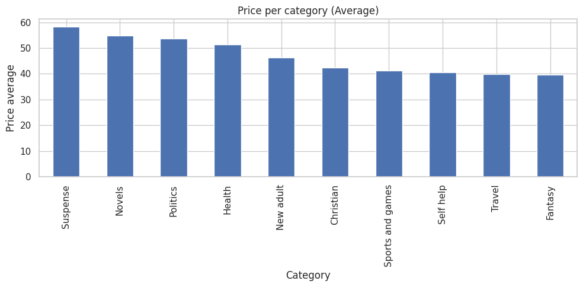

<h1 align="center" style="background-color: #303030; padding: 10px;">
  
</h1>

# Kinamic Challenge
This notebook analyzes the data obtained from web scraping the website [Books to Scrape](https://books.toscrape.com/).

## Index
- [1. Imports](#1.-Imports)
- [2. Load Data](#2.-Load-Data)
- [3. Clean Data 🧹](#3.-Clean-Data-🧹)
- [4. Validations 🤔](#4.-Validations)
- [5. Analysis and Insights 📈](#5.-Analysis-and-Insights)
- [6. Save Clean Data 🛢](#6.-Save-Clean-Data)

## 1. Imports


```python
# Import the libraries we used in this analysis
import pandas as pd
import matplotlib.pyplot as plt
import seaborn as sns

sns.set(style="whitegrid")
plt.rcParams["figure.figsize"] = (10, 5)
```

## 2. Load Data


```python
# Get the DataFrame:
df = pd.read_json('data/raw/books.json', encoding='utf-8')
df
```


<div>
<style scoped>
    .dataframe tbody tr th:only-of-type {
        vertical-align: middle;
    }

    .dataframe tbody tr th {
        vertical-align: top;
    }

    .dataframe thead th {
        text-align: right;
    }
</style>
<table border="1" class="dataframe">
  <thead>
    <tr style="text-align: right;">
      <th></th>
      <th>title</th>
      <th>category</th>
      <th>price</th>
      <th>rating</th>
    </tr>
  </thead>
  <tbody>
    <tr>
      <th>0</th>
      <td>It's Only the Himalayas</td>
      <td>Travel</td>
      <td>£45.17</td>
      <td>Two</td>
    </tr>
    <tr>
      <th>1</th>
      <td>Full Moon over Noah’s Ark: An Odyssey to Mou...</td>
      <td>Travel</td>
      <td>£49.43</td>
      <td>Four</td>
    </tr>
    <tr>
      <th>2</th>
      <td>See America: A Celebration of Our National Par...</td>
      <td>Travel</td>
      <td>£48.87</td>
      <td>Three</td>
    </tr>
    <tr>
      <th>3</th>
      <td>Vagabonding: An Uncommon Guide to the Art of L...</td>
      <td>Travel</td>
      <td>£36.94</td>
      <td>Two</td>
    </tr>
    <tr>
      <th>4</th>
      <td>Under the Tuscan Sun</td>
      <td>Travel</td>
      <td>£37.33</td>
      <td>Three</td>
    </tr>
    <tr>
      <th>...</th>
      <td>...</td>
      <td>...</td>
      <td>...</td>
      <td>...</td>
    </tr>
    <tr>
      <th>995</th>
      <td>Why the Right Went Wrong: Conservatism--From G...</td>
      <td>Politics</td>
      <td>£52.65</td>
      <td>Four</td>
    </tr>
    <tr>
      <th>996</th>
      <td>Equal Is Unfair: America's Misguided Fight Aga...</td>
      <td>Politics</td>
      <td>£56.86</td>
      <td>One</td>
    </tr>
    <tr>
      <th>997</th>
      <td>Amid the Chaos</td>
      <td>Cultural</td>
      <td>£36.58</td>
      <td>One</td>
    </tr>
    <tr>
      <th>998</th>
      <td>Dark Notes</td>
      <td>Erotica</td>
      <td>£19.19</td>
      <td>Five</td>
    </tr>
    <tr>
      <th>999</th>
      <td>The Long Shadow of Small Ghosts: Murder and Me...</td>
      <td>Crime</td>
      <td>£10.97</td>
      <td>One</td>
    </tr>
  </tbody>
</table>
<p>1000 rows × 4 columns</p>
</div>


## 3. Clean Data 🧹


```python
# Clean prices data:
df['price'] = df['price'].str.replace('£', '').astype(float)

# Clean rating:
rating_map = {
    'One': 1, 'Two': 2, 'Three': 3,
    'Four': 4, 'Five': 5
}
df['rating'] = df['rating'].map(rating_map)

# Clean titles:
df['title'] = df['title'].apply(lambda x: x.encode('latin1').decode('utf-8') if 'â' in x else x)

df
```


<div>
<style scoped>
    .dataframe tbody tr th:only-of-type {
        vertical-align: middle;
    }

    .dataframe tbody tr th {
        vertical-align: top;
    }

    .dataframe thead th {
        text-align: right;
    }
</style>
<table border="1" class="dataframe">
  <thead>
    <tr style="text-align: right;">
      <th></th>
      <th>title</th>
      <th>category</th>
      <th>price</th>
      <th>rating</th>
    </tr>
  </thead>
  <tbody>
    <tr>
      <th>0</th>
      <td>It's Only the Himalayas</td>
      <td>Travel</td>
      <td>45.17</td>
      <td>2</td>
    </tr>
    <tr>
      <th>1</th>
      <td>Full Moon over Noah’s Ark: An Odyssey to Mount...</td>
      <td>Travel</td>
      <td>49.43</td>
      <td>4</td>
    </tr>
    <tr>
      <th>2</th>
      <td>See America: A Celebration of Our National Par...</td>
      <td>Travel</td>
      <td>48.87</td>
      <td>3</td>
    </tr>
    <tr>
      <th>3</th>
      <td>Vagabonding: An Uncommon Guide to the Art of L...</td>
      <td>Travel</td>
      <td>36.94</td>
      <td>2</td>
    </tr>
    <tr>
      <th>4</th>
      <td>Under the Tuscan Sun</td>
      <td>Travel</td>
      <td>37.33</td>
      <td>3</td>
    </tr>
    <tr>
      <th>...</th>
      <td>...</td>
      <td>...</td>
      <td>...</td>
      <td>...</td>
    </tr>
    <tr>
      <th>995</th>
      <td>Why the Right Went Wrong: Conservatism--From G...</td>
      <td>Politics</td>
      <td>52.65</td>
      <td>4</td>
    </tr>
    <tr>
      <th>996</th>
      <td>Equal Is Unfair: America's Misguided Fight Aga...</td>
      <td>Politics</td>
      <td>56.86</td>
      <td>1</td>
    </tr>
    <tr>
      <th>997</th>
      <td>Amid the Chaos</td>
      <td>Cultural</td>
      <td>36.58</td>
      <td>1</td>
    </tr>
    <tr>
      <th>998</th>
      <td>Dark Notes</td>
      <td>Erotica</td>
      <td>19.19</td>
      <td>5</td>
    </tr>
    <tr>
      <th>999</th>
      <td>The Long Shadow of Small Ghosts: Murder and Me...</td>
      <td>Crime</td>
      <td>10.97</td>
      <td>1</td>
    </tr>
  </tbody>
</table>
<p>1000 rows × 4 columns</p>
</div>


## 4. Validations


```python
def validate_books_df(df: pd.DataFrame) -> dict:
    """Validates a DataFrame of books scraped from a website.

    Args:
        df (pd.DataFrame): The DataFrame to validate.

    Returns:
        dict: A dictionary with validation status and issues found.
    """
    issues = {}

    # 1. Column presence check
    expected_columns = {'title', 'category', 'price', 'rating'}
    if not expected_columns.issubset(df.columns):
        issues['missing_columns'] = list(expected_columns - set(df.columns))

    # 2. Nulls check
    null_counts = df.isnull().sum()
    null_issues = null_counts[null_counts > 0].to_dict()
    if null_issues:
        issues['null_values'] = null_issues

    # 3. Data types check
    if not pd.api.types.is_numeric_dtype(df['price']):
        issues['price_dtype'] = 'Expected numeric'
    if not pd.api.types.is_numeric_dtype(df['rating']):
        issues['rating_dtype'] = 'Expected numeric'

    # 4. Price values check
    if (df['price'] < 0).any():
        issues['invalid_prices'] = 'Price contains negative values'

    # 5. Rating values check (expected 1 to 5)
    if not df['rating'].between(1, 5).all():
        issues['invalid_ratings'] = 'Rating must be between 1 and 5'

    # 6. Title and category empty strings
    for col in ['title', 'category']:
        if (df[col].astype(str).str.strip() == '').any():
            issues[f'invalid_{col}'] = f'{col} contains empty or whitespace-only strings'

    return {'is_valid': len(issues) == 0, 'issues': issues}
```


```python
result = validate_books_df(df)
print(result)
```

    {'is_valid': True, 'issues': {}}


### Don't found issues

## 5. Analysis and Insights

### 5.1 **Number of books per category:** Here we can see the categories that have the most books


```python
plt.figure(figsize=(10, 4))
category_counts = df['category'].value_counts().head(10)
sns.barplot(x=category_counts.values, y=category_counts.index)
plt.title('Number of Books per Category - TOP 10 ')
plt.xlabel('Number of Books')
plt.ylabel('Category')
plt.tight_layout()
plt.show()
```


    

    


### 5.2 **Price per category (Average):** Which category has the most expensive books?


```python
avg_price_per_category = df.groupby('category')['price'].mean().sort_values(ascending=False).head(10)

avg_price_per_category.plot(kind='bar')
plt.title('Price per category (Average)')
plt.ylabel('Price average')
plt.xlabel('Category')
plt.tight_layout()
plt.show()
```


    

    


### 5.3 **Rating per category:** Categories with the best rating


```python
avg_rating_by_category = df.groupby('category')['rating'].mean().sort_values(ascending=False).head(5)

avg_rating_by_category.plot(kind='bar')
plt.title('Rating per category (Average)')
plt.xlabel('Category')
plt.ylabel('Rating average')
plt.xticks(rotation=0)
plt.tight_layout()
plt.show()
```


    

    


### 5.4 Top 5 Most Expensive Books


```python
top5_expensive_books = df.nlargest(5, 'price')
top5_expensive_books
```


<div>
<style scoped>
    .dataframe tbody tr th:only-of-type {
        vertical-align: middle;
    }

    .dataframe tbody tr th {
        vertical-align: top;
    }

    .dataframe thead th {
        text-align: right;
    }
</style>
<table border="1" class="dataframe">
  <thead>
    <tr style="text-align: right;">
      <th></th>
      <th>title</th>
      <th>category</th>
      <th>price</th>
      <th>rating</th>
    </tr>
  </thead>
  <tbody>
    <tr>
      <th>191</th>
      <td>The Perfect Play (Play by Play #1)</td>
      <td>Romance</td>
      <td>59.99</td>
      <td>3</td>
    </tr>
    <tr>
      <th>271</th>
      <td>Last One Home (New Beginnings #1)</td>
      <td>Fiction</td>
      <td>59.98</td>
      <td>3</td>
    </tr>
    <tr>
      <th>845</th>
      <td>Civilization and Its Discontents</td>
      <td>Psychology</td>
      <td>59.95</td>
      <td>2</td>
    </tr>
    <tr>
      <th>925</th>
      <td>The Barefoot Contessa Cookbook</td>
      <td>Food and drink</td>
      <td>59.92</td>
      <td>5</td>
    </tr>
    <tr>
      <th>368</th>
      <td>The Diary of a Young Girl</td>
      <td>Nonfiction</td>
      <td>59.90</td>
      <td>3</td>
    </tr>
  </tbody>
</table>
</div>


### 5.5 Top 5 Cheapest Books


```python
top5_cheapest_books = df.nsmallest(5, 'price')
top5_cheapest_books
```


<div>
<style scoped>
    .dataframe tbody tr th:only-of-type {
        vertical-align: middle;
    }

    .dataframe tbody tr th {
        vertical-align: top;
    }

    .dataframe thead th {
        text-align: right;
    }
</style>
<table border="1" class="dataframe">
  <thead>
    <tr style="text-align: right;">
      <th></th>
      <th>title</th>
      <th>category</th>
      <th>price</th>
      <th>rating</th>
    </tr>
  </thead>
  <tbody>
    <tr>
      <th>781</th>
      <td>An Abundance of Katherines</td>
      <td>Young adult</td>
      <td>10.00</td>
      <td>5</td>
    </tr>
    <tr>
      <th>804</th>
      <td>The Origin of Species</td>
      <td>Science</td>
      <td>10.01</td>
      <td>4</td>
    </tr>
    <tr>
      <th>666</th>
      <td>The Tipping Point: How Little Things Can Make ...</td>
      <td>Add a comment</td>
      <td>10.02</td>
      <td>2</td>
    </tr>
    <tr>
      <th>77</th>
      <td>Patience</td>
      <td>Sequential art</td>
      <td>10.16</td>
      <td>3</td>
    </tr>
    <tr>
      <th>497</th>
      <td>Greek Mythic History</td>
      <td>Default</td>
      <td>10.23</td>
      <td>5</td>
    </tr>
  </tbody>
</table>
</div>


## 6. Save Clean Data


```python
# Save data to a clean CSV
df.to_csv('data/processed/books.csv', sep=";",index=False)
```
